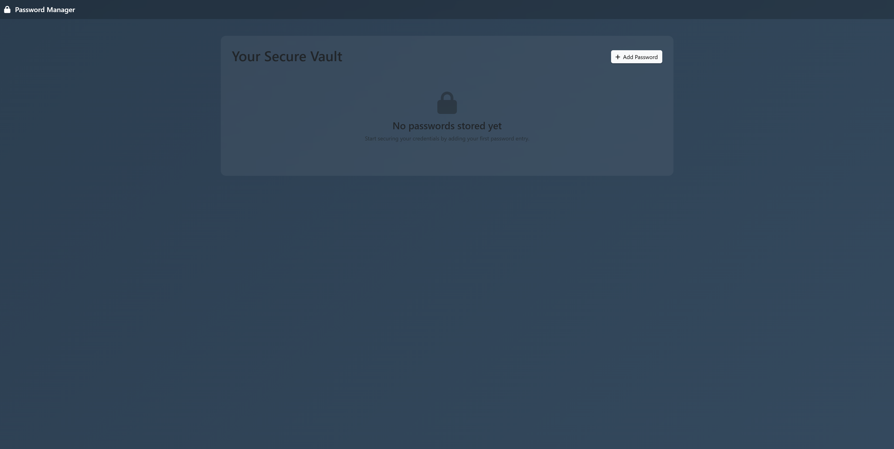

# Password Manager

A secure, cross-platform password manager built with Tauri, React, and Rust. Features AES-256-GCM encryption for secure password storage and a modern, intuitive user interface.

## Features

- 🔐 **Secure Encryption**: AES-256-GCM encryption for all stored passwords
- 🎨 **Modern UI**: Clean, responsive interface built with React and Bootstrap
- 💾 **Local Storage**: SQLite database for local password storage
- 📋 **Clipboard Integration**: One-click password copying with auto-clear
- 🏷️ **Organization**: Categorize passwords for easy management
- 📝 **Notes Support**: Add notes to password entries
- 🖥️ **Cross-Platform**: Works on Windows, macOS, and Linux

## Screenshots



## Quick Start (Windows Users)

🚀 **Want to try it immediately?** 

1. **Download this repository** (green "Code" button → "Download ZIP")
2. **Extract the ZIP file**
3. **Double-click `password_app.exe`** 
4. **That's it!** No installation needed.

The app will start immediately and you can begin using your secure password manager right away.

## Prerequisites

### General Requirements
- Node.js 18+ and npm
- Rust 1.70+
- Git

### Linux (Ubuntu/Debian) Requirements

**For Ubuntu 24.04 and newer**, you'll need to install additional dependencies due to WebKit compatibility issues:

```bash
# Install basic dependencies
sudo apt update
sudo apt install -y build-essential curl wget libssl-dev libgtk-3-dev libayatana-appindicator3-dev librsvg2-dev

# For Ubuntu 24.04+: Install WebKit 4.0 (required for Tauri 1.x)
./install-webkit.sh
```

**For Ubuntu 22.04 and older:**
```bash
sudo apt update
sudo apt install -y libwebkit2gtk-4.0-dev build-essential curl wget libssl-dev libgtk-3-dev libayatana-appindicator3-dev librsvg2-dev
```

### Windows Requirements
- Microsoft Visual Studio C++ Build Tools
- WebView2 (usually pre-installed on Windows 10/11)

### macOS Requirements
- Xcode Command Line Tools: `xcode-select --install`

## Installation

### Option 1: Ready-to-Run (Windows)
**🎯 Fastest way to get started:**
- Download `password_app.exe` from this repository
- Double-click to run - no installation required!
- Works on Windows 10/11 out of the box

### Option 2: Download Pre-built Binaries
Download the latest release from the [Releases](https://github.com/CloudTigerx/password-manager/releases) page:
- **Linux**: `.deb` or `.rpm` package
- **Windows**: `.msi` installer
- **macOS**: `.dmg` file

### Option 3: Build from Source

1. **Clone the repository:**
   ```bash
   git clone https://github.com/CloudTigerx/password-manager.git
   cd password-manager
   ```

2. **Install dependencies:**
   ```bash
   npm install
   ```

3. **Install Tauri CLI:**
   ```bash
   npm install -g @tauri-apps/cli
   ```

4. **For Ubuntu 24.04+, install WebKit dependencies:**
   ```bash
   chmod +x install-webkit.sh
   ./install-webkit.sh
   ```

5. **Build the application:**
   ```bash
   npm run tauri build
   ```

   The built packages will be available in `src-tauri/target/release/bundle/`

## Development

### Running in Development Mode

1. **Start the development server:**
   ```bash
   npm run tauri dev
   ```

2. **For web-only development:**
   ```bash
   npm run dev
   ```
   Then open http://localhost:1420 in your browser.

### Project Structure

```
password-app/
├── src/                    # React frontend
│   ├── App.jsx            # Main React component
│   ├── App.css            # Styles
│   └── main.jsx           # React entry point
├── src-tauri/             # Tauri backend
│   ├── src/
│   │   └── lib.rs         # Rust backend logic
│   ├── Cargo.toml         # Rust dependencies
│   └── tauri.conf.json    # Tauri configuration
├── install-webkit.sh      # Ubuntu 24.04 setup script
└── README.md              # This file
```

### Key Technologies

- **Frontend**: React 18, Bootstrap 5, FontAwesome
- **Backend**: Rust, Tauri 1.8
- **Database**: SQLite with rusqlite
- **Encryption**: AES-256-GCM via aes-gcm crate
- **Build Tool**: Vite

## Troubleshooting

### White Screen on Startup

If you encounter a white screen when running the app, this is typically due to missing WebKit dependencies on Linux. Follow these steps:

1. **For Ubuntu 24.04+:**
   ```bash
   ./install-webkit.sh
   ```

2. **For other Linux distributions:**
   Install the appropriate WebKit development packages for your distribution.

3. **Verify installation:**
   ```bash
   pkg-config --exists webkit2gtk-4.0 && echo "WebKit found" || echo "WebKit missing"
   ```

### Build Errors on Linux

If you encounter build errors related to missing system libraries:

1. **Install all required dependencies:**
   ```bash
   sudo apt install -y libwebkit2gtk-4.0-dev build-essential curl wget libssl-dev libgtk-3-dev libayatana-appindicator3-dev librsvg2-dev pkg-config
   ```

2. **For Ubuntu 24.04+, use the provided script:**
   ```bash
   ./install-webkit.sh
   ```

### Port Already in Use

If you get a "Port 1420 is already in use" error:

```bash
# Kill existing processes
pkill -f "npm run dev"
pkill -f "vite"

# Wait a moment and try again
npm run tauri dev
```

## Security

- **Encryption**: All passwords are encrypted using AES-256-GCM before storage
- **Key Management**: Encryption keys are generated per session (in production, implement secure key storage)
- **Local Storage**: All data is stored locally in an SQLite database
- **Clipboard Security**: Copied passwords are automatically cleared after 30 seconds

⚠️ **Important**: This is a demonstration application. For production use, implement proper key management and consider additional security measures.

## Contributing

1. Fork the repository
2. Create a feature branch: `git checkout -b feature-name`
3. Make your changes and test thoroughly
4. Commit your changes: `git commit -am 'Add feature'`
5. Push to the branch: `git push origin feature-name`
6. Submit a pull request

## License

This project is licensed under the MIT License - see the [LICENSE](LICENSE) file for details.

## Acknowledgments

- [Tauri](https://tauri.app/) for the excellent framework
- [React](https://reactjs.org/) for the frontend framework
- [Bootstrap](https://getbootstrap.com/) for the UI components
- [FontAwesome](https://fontawesome.com/) for the icons

## Support

If you encounter any issues or have questions:

1. Check the [Troubleshooting](#troubleshooting) section
2. Search existing [Issues](https://github.com/yourusername/password-app/issues)
3. Create a new issue with detailed information about your problem

---

**Note**: Replace `yourusername` in the URLs with your actual GitHub username when publishing.
